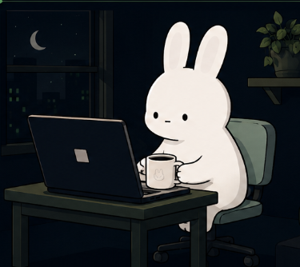

<div align="center">

# Hi, I'm Jebisha Thapa 👋

### Computer Science Student • Python • DSA • Web Development

Building strong engineering fundamentals one project at a time.

</div>

<table>
<tr>

<td width="55%" valign="top">

## 💻 Terminal

```console
$ whoami

Jebisha Thapa
Computer Science Student
Kathmandu, Nepal

$ learning

• Python
• Data Structures & Algorithms
• Web Development

$ building

• Python Projects
• Strong CS Fundamentals

$ currently

Learning one concept.
Building one project.
Improving every day.
```

<td width="45%" align="center">



</td>


</tr>
</table>


